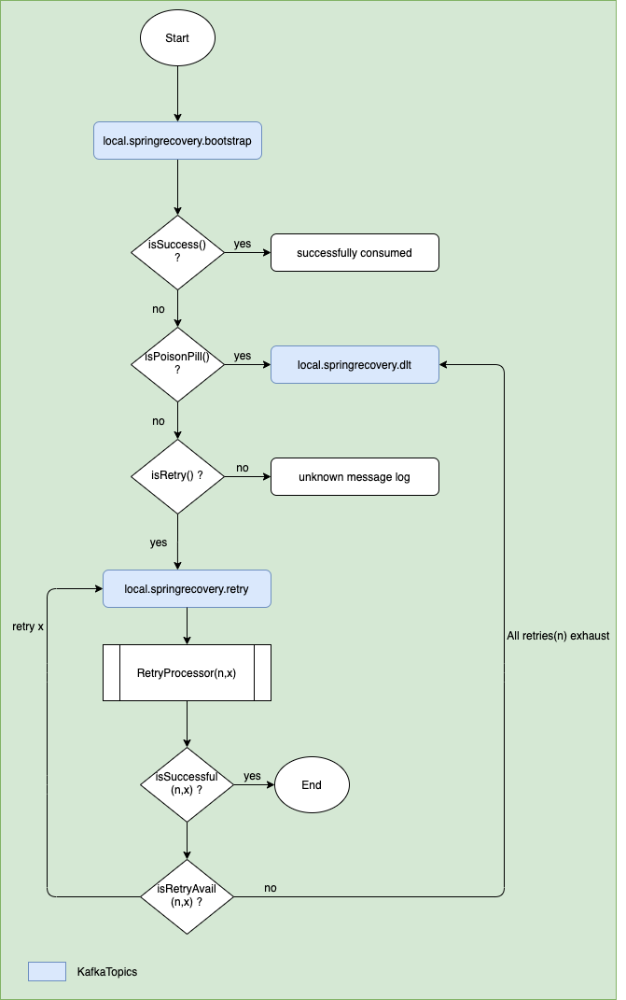

# spring-kafka-recovery

Demo of Spring Kafka recovery using retry &amp; dead letter topics 

# Build & Run

To check out the project and build from source, do the following:
    
    # Clone repo
    $ gh repo clone Raghav2211/spring-kafka-recovery
    
    # Build
    $ ./gradlew build
    
    # Up zookeeper & kafka container 
    $ docker-compose up -d
    
    # Run application
    $ java -jar build/libs/spring-kafka-recovery-0.0.1.jar
    
    # exec into broker container & send data 
    $ docker exec -it smex-env_broker_1 /usr/bin/kafka-console-producer --broker-list localhost:9092 --topic local.springrecovery.bootstrap
    > SUCCESS      <-- Consume successful 
    > POISON_PILL  <-- Consume & send to dlt(Deal letter topic)
    > RETRY        <-- Consume & send to retry topic, after provided retries if data not proceed successfully it'll be send to dlt(Deal letter topic)     
    
